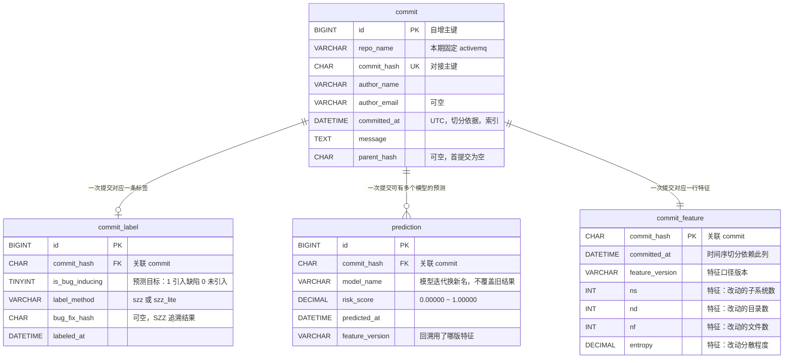

# 契约一：数据表字段

> 状态：**草案，未冻结** ｜ 版本 0.91 ｜ 定稿人 蒋励 + 吕建江 ｜ 冻结时间 第 2 周末（9/18）

## 管什么

模型线产出的数据要落进数据库，后端线建表读它。**两边写的字段名必须一模一样**，否则接不上。

## 命名约定

- 一律 `snake_case`（小写 + 下划线），例：`commit_hash`，不写 `commitHash` 或 `CommitHash`
- 布尔字段以 `is_` 开头，例：`is_bug_inducing`
- 时间字段以 `_at` 结尾且**统一 UTC 时区**，例：`committed_at`
- 主键：单表用 `id`（自增整数）；提交表另有业务主键 `commit_hash`

## 表一：`commit`（提交表）

一行 = 一次代码提交。

| 字段 | 类型 | 说明 | 必填 |
|---|---|---|---|
| `id` | BIGINT | 自增主键 | 是 |
| `repo_name` | VARCHAR(64) | 仓库名，本期固定 `activemq` | 是 |
| `commit_hash` | CHAR(40) | 提交的完整哈希，**模型线与后端线的对接主键** | 是 |
| `author_name` | VARCHAR(128) | 提交者名称（取自提交记录） | 是 |
| `author_email` | VARCHAR(128) | 提交者邮箱（用于跨改名识别同一人） | 否 |
| `committed_at` | DATETIME | 提交时间（UTC）。**时间序切分训练/检验集靠这个字段** | 是 |
| `message` | TEXT | 提交信息原文 | 是 |
| `parent_hash` | CHAR(40) | 父提交哈希（首提交为空） | 否 |

**索引要求**：`commit_hash` 唯一索引；`committed_at` 普通索引（切分与趋势图都要按时间查）。

## 表二：`commit_label`（缺陷标签表）

一行 = 一次提交的缺陷判定结果。**与 `commit` 分开建表**，因为标签可能被重算（打标方法升级后要重跑），分开后不必动原始数据。

| 字段 | 类型 | 说明 | 必填 |
|---|---|---|---|
| `id` | BIGINT | 自增主键 | 是 |
| `commit_hash` | CHAR(40) | 关联 `commit.commit_hash` | 是 |
| `is_bug_inducing` | TINYINT(1) | **本项目的预测目标（标签）**：1 = 引入缺陷，0 = 未引入 | 是 |
| `label_method` | VARCHAR(32) | 打标方法：`szz`（PySZZ）/ `szz_lite`（自研简化版） | 是 |
| `bug_fix_hash` | CHAR(40) | 触发本次判定的修复提交哈希（SZZ 追溯结果） | 否 |
| `labeled_at` | DATETIME | 打标时间（UTC） | 是 |

**为什么要记 `label_method`**：本组要用自研简化版与 PySZZ 做对照校验。方法名不记下来，两份结果混在一张表里就分不清了。

## 表三：`prediction`（预测结果表）

一行 = 某次提交在某模型下的一次预测。

| 字段 | 类型 | 说明 | 必填 |
|---|---|---|---|
| `id` | BIGINT | 自增主键 | 是 |
| `commit_hash` | CHAR(40) | 关联 `commit.commit_hash` | 是 |
| `model_name` | VARCHAR(64) | 模型标识，例：`xgb_v1`。**模型迭代后换新名字，不覆盖旧结果** | 是 |
| `risk_score` | DECIMAL(6,5) | 风险概率，取值 `0.00000` ~ `1.00000` | 是 |
| `predicted_at` | DATETIME | 预测时间（UTC） | 是 |
| `feature_version` | VARCHAR(32) | 特征表版本，用于回溯「这个预测用的哪版特征」 | 是 |

**为什么保留 `model_name` + `feature_version`**：三个页面里有一个是趋势看板，要对比不同模型的风险分布。不区分版本，历史预测就没法解释。

## ER 图（鸦爪法 / Crow's Foot）

课程《产品设计文档》模板明确要求「提供数据库 ER 图（陈氏法 或 鸦爪法）」。本图用鸦爪法（crow's foot）表示基数关系。

> 生成方式：WorkBuddy（AI 生成，Mermaid `erDiagram`）｜提示词：「读 docs/contracts/data-fields.md 与 feature-columns.md，用 Mermaid erDiagram 画出四张表的关系，标出主键、唯一键、外键与基数」
> —— 课程要求 AI 生成的图必须标注 LLM 工具名称与提示词，本条即为示例写法。

**关系说明**

| 关系 | 基数 | 为什么这么设计 |
|---|---|---|
| `commit` → `commit_label` | 1 : 0..1 | 标签可能尚未算出（时间太近的提交还没被后续修复提交追溯到），所以是「零或一」而非「必有」 |
| `commit` → `prediction` | 1 : 0..N | 多个模型版本可对同一次提交各给一次预测，趋势看板要对比模型，所以允许多行 |
| `commit` → `commit_feature` | 1 : 1 | 一行特征对应一次提交；特征口径变化通过 `feature_version` 区分，不重建表 |

> `commit_feature` 的完整字段清单（14 项特征）在 `feature-columns.md` 第二节与第三节，本图只画出标识列与前 4 项特征，避免图过宽。

**联表查询的注意点**

- 三张附表都通过 `commit_hash` 关联（不是自增 `id`）—— `commit_hash` 才是模型线与后端线的对接主键。
- 查「某次提交的详情」需要三表连接：`commit` + `commit_label`（真实标签）+ `prediction`（风险概率）。
- 查「风险列表」以 `prediction` 为主表、`commit` 为维表 —— 因为排序依据 `risk_score` 在 `prediction` 里。

---

## 不写进契约的（后端线自行决定）

- 是否需要额外的关联表、中间表
- 字段的字符集与排序规则
- 分区策略、归档策略
- 具体的索引冗余设计（上面只列了跨线必需的两个）

## 待确认

- [ ] `prediction` 表是否需要存「真实标签回填」字段（用于前端展示「模型这次判对了没有」）—— 待刘帅华确认页面是否需要
- [ ] 提交记录数量级是否需要分表 —— 待跑通数据链路后按实际量级判断
- [ ] 是否需要 `commit` 表记录「修改文件列表」—— 若特征计算时需要，需在特征表另建子表

## 变更日志

| 日期 | 版本 | 变更人 | 主要变更 |
|---|---|---|---|
| 2026-09-16 | 0.9 | 蒋励 | 初版草案：三张表与命名约定 |
| 2026-09-16 | 0.91 | 蒋励 | 新增 **ER 图**（鸦爪法 / Mermaid）：四张表基数关系、三张附表均以 `commit_hash` 关联、三表连接的查询注意点。补齐课程《产品设计文档》模板要求的「数据库 ER 图」 |
