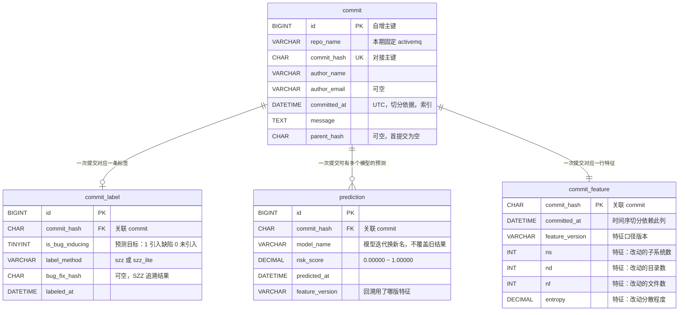

# 契约一：数据表字段

> 状态：**已冻结** ｜ 版本 1.2 ｜ 定稿人 蒋励 + 吕建江 ｜ 冻结日期 2026-09-18 ｜ 冻结人 蒋励、吕建江
> 1.2 版为**打标方法说明的改口**：`szz` 的括注由「（PySZZ）」改为「标准行级 SZZ，自研实现」—— PySZZ 不在 PyPI，实测结论见表二脚注。**取值枚举、列名、类型、索引均未改动**（1.1 版新增的「建表归属」一节见变更日志）。

## 管什么

模型线产出的数据要落进数据库，后端线建表读它。**两边写的字段名必须一模一样**，否则接不上。

### 建表归属（2026-09-16 补明确，解冻结前疑义）

**四张表全部由后端线建**，同一份迁移脚本，与接口一起交付。数据与模型线只产出数据，不建库表。

| 表 | 谁建 | 数据从哪来 |
|---|---|---|
| `commit` | 后端 | 数据线 `01_extract_commits.py` 产出的提交清单 |
| `commit_label` | 后端 | 数据线 `02_szz_labeling.py` 产出的标签表 |
| `commit_feature` | 后端 | 数据线 `03_extract_features.py` 产出的特征表 |
| `prediction` | 后端 | 后端实时推理写入；历史批量结果由**数据线离线预测产出 `prediction_result.csv`、由后端线导入本表**（数据线不直连数据库） |

**入库链路**：数据线按 `docs/data-pipeline.md` 跑完 01–04 生成 CSV → 后端用导入脚本按本契约的表结构写入库。**"别人 clone 后一条命令把库建好"的前提是先跑完数据线 01–04**，这条要写进后端的启动说明。

**为什么之前写着「三张表」**：那是后端 README 的清单当时**漏列了 `commit_feature`**。字段本身从来没有争议 —— `feature-columns.md` 第 1 节早已定下表名 `commit_feature` 与全部列定义；模糊的只是「谁建、什么时候建」，现明确：**后端建，与另外三张同时、在 9/18 字段冻结后立即开工**（对齐飞书周报任务 7 排期）。

> 提交详情接口（`GET /api/commits/{commit_hash}`）要返回的那 14 项特征，正是从 `commit_feature` 读出来的 —— 这张表不建，详情页就没有数据源。

## 命名约定

- 一律 `snake_case`（小写 + 下划线），例：`commit_hash`，不写 `commitHash` 或 `CommitHash`
- 布尔字段以 `is_` 开头，例：`is_bug_inducing`
- 时间字段以 `_at` 结尾且**统一 UTC 时区**，例：`committed_at`
- 主键：单表用 `id`（自增整数）；提交表另有业务主键 `commit_hash`

## 表一：`commit`（提交表）

一行 = 一次代码提交。

| 字段 | 类型 | 说明 | 必填 |
|---|---|---|---|
| `id` | BIGINT | 自增主键 | 是 |
| `repo_name` | VARCHAR(64) | 仓库名，本期固定 `activemq` | 是 |
| `commit_hash` | CHAR(40) | 提交的完整哈希，**模型线与后端线的对接主键** | 是 |
| `author_name` | VARCHAR(128) | 提交者名称（取自提交记录） | 是 |
| `author_email` | VARCHAR(128) | 提交者邮箱（用于跨改名识别同一人） | 否 |
| `committed_at` | DATETIME | 提交时间（UTC）。**时间序切分训练/检验集靠这个字段** | 是 |
| `message` | TEXT | 提交信息原文 | 是 |
| `parent_hash` | CHAR(40) | 父提交哈希（首提交为空） | 否 |

**索引要求**：`commit_hash` 唯一索引；`committed_at` 普通索引（切分与趋势图都要按时间查）。

## 表二：`commit_label`（缺陷标签表）

一行 = 一次提交的缺陷判定结果。**与 `commit` 分开建表**，因为标签可能被重算（打标方法升级后要重跑），分开后不必动原始数据。

| 字段 | 类型 | 说明 | 必填 |
|---|---|---|---|
| `id` | BIGINT | 自增主键 | 是 |
| `commit_hash` | CHAR(40) | 关联 `commit.commit_hash` | 是 |
| `is_bug_inducing` | TINYINT(1) | **本项目的预测目标（标签）**：1 = 引入缺陷，0 = 未引入 | 是 |
| `label_method` | VARCHAR(32) | 打标方法：`szz`（标准行级 SZZ，自研实现）/ `szz_lite`（文件级回溯简化版，自研） | 是 |
| `bug_fix_hash` | CHAR(40) | 触发本次判定的修复提交哈希（SZZ 追溯结果） | 否 |
| `labeled_at` | DATETIME | 打标时间（UTC） | 是 |

**为什么要记 `label_method`**：本组要用两种粒度的 SZZ 做对照校验 —— 标准行级回溯与文件级简化回溯。方法名不记下来，两份结果混在一张表里就分不清了。

> **为什么不是 PySZZ（2026-09-16 实测改口）**：本文原先把 `szz` 标注为「（PySZZ）」。实测 **PySZZ 不在 PyPI**（`https://pypi.org/pypi/pyszz/json` 返回 404；同批探测 `pydriller` 正常返回 200，排除网络因素），其官方仓库依赖预先生成的 `gitlog` 数据格式，属研究专用工具，Sprint 0 内跑通不现实。故 `szz` 改由数据线**自研实现标准行级 SZZ**（对修复提交改动掉的每一行在父提交上做 `git blame`）。
>
> **取值集合仍是 `{szz, szz_lite}` 不变，只改说明文字，不触发 `feature_version` 升级**；两套结果都保留、差异量化后出示，对照校验的做法不变。裁定过程见 `docs/data-pipeline.md` 第 7 节待定项 1。

## 表三：`prediction`（预测结果表）

一行 = 某次提交在某模型下的一次预测。

| 字段 | 类型 | 说明 | 必填 |
|---|---|---|---|
| `id` | BIGINT | 自增主键 | 是 |
| `commit_hash` | CHAR(40) | 关联 `commit.commit_hash` | 是 |
| `model_name` | VARCHAR(64) | 模型标识，例：`xgb_v1`。**模型迭代后换新名字，不覆盖旧结果** | 是 |
| `risk_score` | DECIMAL(6,5) | 风险概率，取值 `0.00000` ~ `1.00000` | 是 |
| `predicted_at` | DATETIME | 预测时间（UTC） | 是 |
| `feature_version` | VARCHAR(32) | 特征表版本，用于回溯「这个预测用的哪版特征」 | 是 |

**为什么保留 `model_name` + `feature_version`**：三个页面里有一个是趋势看板，要对比不同模型的风险分布。不区分版本，历史预测就没法解释。

> **本表不存「真实标签回填」字段** —— 理由见下方冻结结论第 1 条。

## ER 图（鸦爪法 / Crow's Foot）

课程《产品设计文档》模板明确要求「提供数据库 ER 图（陈氏法 或 鸦爪法）」。本图用鸦爪法（crow's foot）表示基数关系。

> 生成方式：WorkBuddy（AI 生成，Mermaid `erDiagram`）｜提示词：「读 docs/contracts/data-fields.md 与 feature-columns.md，用 Mermaid erDiagram 画出四张表的关系，标出主键、唯一键、外键与基数」
> —— 课程要求 AI 生成的图必须标注 LLM 工具名称与提示词，本条即为示例写法。

**关系说明**

| 关系 | 基数 | 为什么这么设计 |
|---|---|---|
| `commit` → `commit_label` | 1 : 0..1 | 标签可能尚未算出（时间太近的提交还没被后续修复提交追溯到），所以是「零或一」而非「必有」 |
| `commit` → `prediction` | 1 : 0..N | 多个模型版本可对同一次提交各给一次预测，趋势看板要对比模型，所以允许多行 |
| `commit` → `commit_feature` | 1 : 1 | 一行特征对应一次提交；特征口径变化通过 `feature_version` 区分，不重建表 |

> `commit_feature` 的完整字段清单（14 项特征）在 `feature-columns.md` 第二节与第三节，本图只画出标识列与前 4 项特征，避免图过宽。

**联表查询的注意点**

- 三张附表都通过 `commit_hash` 关联（不是自增 `id`）—— `commit_hash` 才是模型线与后端线的对接主键。
- 查「某次提交的详情」需要三表连接：`commit` + `commit_label`（真实标签）+ `prediction`（风险概率）。
- 查「风险列表」以 `prediction` 为主表、`commit` 为维表 —— 因为排序依据 `risk_score` 在 `prediction` 里。

---

## 不写进契约的（后端线自行决定）

- 是否需要额外的关联表、中间表
- 字段的字符集与排序规则
- 分区策略、归档策略
- 具体的索引冗余设计（上面只列了跨线必需的两个）

## 冻结结论（原「待确认」，**2026-09-16 结清**；冻结日期 2026-09-18）

| 原待确认项 | 结论 |
|---|---|
| `prediction` 表是否需要存「真实标签回填」字段 | **不需要**。真实标签的唯一来源是 `commit_label`，而它带 `label_method` 且可能随打标方法升级被重算；在 `prediction` 里冗余存一份，会出现「标签重算后 `prediction` 仍留旧值」的不一致，还要处理双写。若页面将来要展示「模型这次判对了没有」，由后端 join `commit_label` 现算即可，无需落库。**页面侧的对应结论是 MVP 不展示该项**，见契约三的冻结结论 |
| 提交记录数量级是否需要分表 | **不分表**。实测固定版本 `activemq-5.18.7`：提交总数 11,616 条，过滤合并提交后 11,050 条。MySQL 单表在千万行量级仍可承载，本量级不需要分表。**重评阈值：单表行数超过 500 万行时再议** |
| 是否需要 `commit` 表记录「修改文件列表」 | **不记入 `commit` 表**。该表服务于接口查询（列表、详情）；文件级明细一行提交可有数十条，塞进来会让表一失去可读性、查询也变重。**特征计算所需的文件级明细由数据线中间产物承载、不入库** —— 特征表 `commit_feature` 已是最终产物，中间明细没有查询需求 |

## 变更日志

| 日期 | 版本 | 变更人 | 主要变更 |
|---|---|---|---|
| 2026-09-16 | 0.9 | 蒋励 | 初版草案：三张表与命名约定 |
| 2026-09-16 | 0.91 | 蒋励 | 新增 **ER 图**（鸦爪法 / Mermaid）：四张表基数关系、三张附表均以 `commit_hash` 关联、三表连接的查询注意点。补齐课程《产品设计文档》模板要求的「数据库 ER 图」 |
| 2026-09-16 | 1.0 | 蒋励 | **冻结**：结清三项待确认 —— ① `prediction` 不存真实标签回填（标签唯一来源是 `commit_label`，避免重算后不一致）；② 不分表（按实测 11,050 条量级判定，写入 500 万行重评阈值）；③ `commit` 表不记文件列表（文件级明细由数据线中间产物承载、不入库） |
| 2026-09-16 | 1.1 | 吕建江提出、蒋励裁定 | **字段冻结前疑义澄清**：新增「建表归属」一节 —— 明确四张表（含此前被漏列的 `commit_feature`）**全部由后端建**，并给出每张表的数据来源与入库链路。**未改任何列名、类型或索引**，字段定义与 1.0 逐字一致 |
| 2026-09-17 | 1.3 | 蒋励 | **把「谁写 `prediction` 表」说清（审阅意见）**：表三的「入库方」原写「历史批量结果由数据线离线预测产出」，读不出是数据线插库还是后端导入，而 `data_model/README.md` 同期写的是「模型线批量预测写 `prediction` 表」—— 两处合起来会被读成**数据线直连数据库**，与 `model-training-and-delivery` 的 design D8「不直连数据库」冲突。现明确为：**数据线产出 `prediction_result.csv`，由后端线导入**，三处口径统一。同版修正：冻结结论标题的结清日期由 9/18 改为 **2026-09-16**（9/18 是冻结日期，两者不是同一天） |
| 2026-09-16 | 1.2 | 蒋励 | **打标方法说明改口（因实现与契约不符）**：表二 `szz` 的括注由「（PySZZ）」改为「标准行级 SZZ，自研实现」，并把「与 PySZZ 做对照校验」改为「两种粒度的 SZZ 对照校验」，理由见该表脚注。触发原因：数据链路全量跑通时，`02_szz_labeling.py` 的报告自己报出该括注已不成立（PySZZ 不在 PyPI，实测 404）。**取值枚举 `{szz, szz_lite}`、列名、类型、索引均未改动**，不触发 `feature_version` 升级 |
